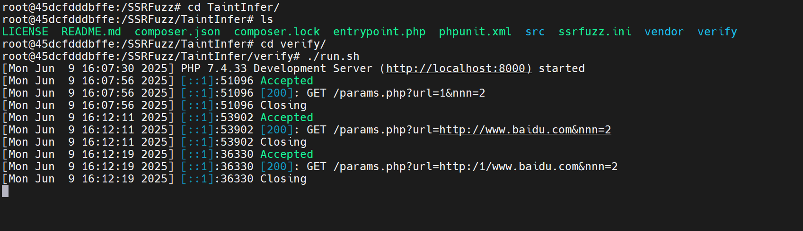
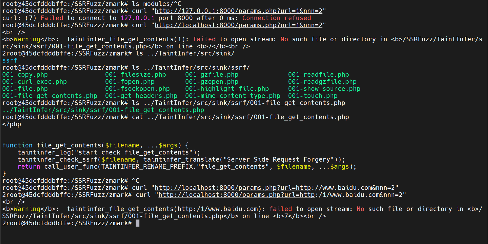
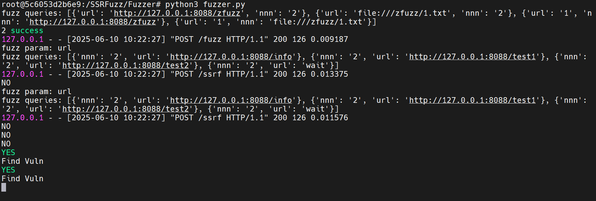
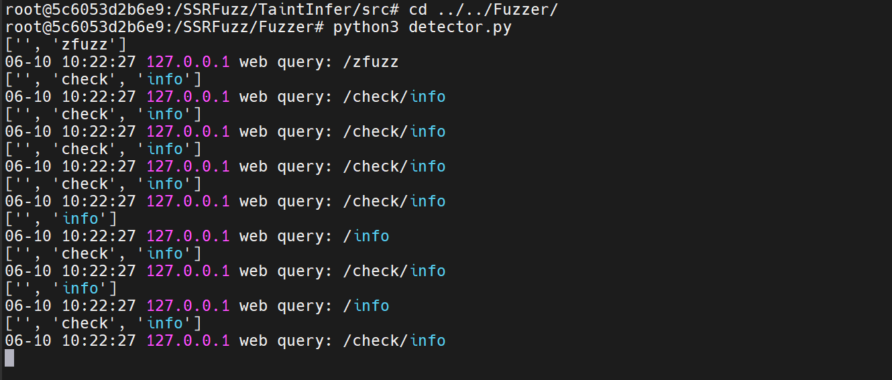
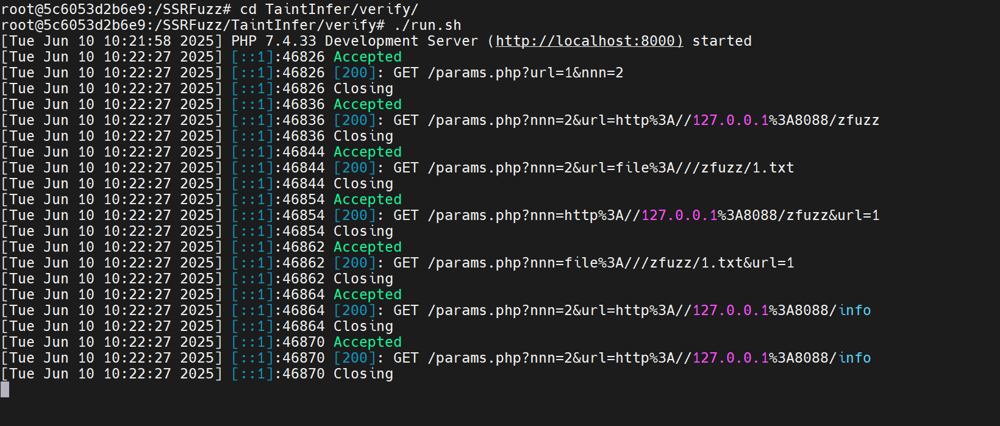
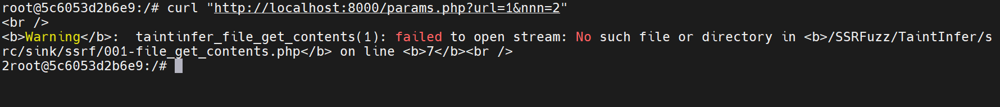

```bash
root@45dcfdddbffe:/SSRFuzz/TaintInfer/verify# ./run.sh
curl "http://localhost:8000/params.php?url=1&nnn=2"
curl "http://localhost:8000/params.php?url=http://www.baidu.com&nnn=2"
```


可以发现我们的url参数被成功截获！

url=1是非法，url=www.baidu.com是正常


---

四个terminal：

fuzzer.py:




detector.py:




./run.sh:




curl:




---


taint识别到url参数最终触发了sink，所以对url进行fuzz，替换为能够被detector检测的"url"，中间加了绕filter的字符


---

如果是需要多参数共同决定最终的sink点的参数？（比如 `$a.$b`） <= To Be Check

params.php改了下：

```php
$result = file_get_contents($url.$nnn);
```

发现检测不出来了


paper实现的好像就只能是单param的

```python
        if 'query' in self.request and self.request['query']:
            self.fuzz_query() // 里面用的fuzz_one_value

        if 'data' in self.request and self.request['data']:
            self.fuzz_body()

```


算个未来的挑战吧


---

substring 等于 identical 吗？ 如果是filter过后，也可能出现substring🤔

oo，有个Δlen<=3的检测。 ✔️


---

fuzzer.py send malicious attack requests and the detector.py as the callback/listener to monitor


---

how fuzzer.py interacts with the dynamic TaintAnalysis stage?

using db to store and read


whenver some parameters reach the sink function, the hooked sink will taintinfer_check_ssrf, in which `  updateVulnType($taintinfer_vuln_type, $fuzz_param);` is used.

the taint stage leaves message about which parameter is vulnerable, narrowing down the input space for fuzzing stage


Q

1. The Multi-Parameter Problem
2. The "Semantic Gap" in Similarity
3. in realworld project vlun mining, how to first start a "manual curl"?

   A: crawler


Expanding:

1. Zend -> JVM
2. SSRF -> RCE, xxx Injection


---

Prof's Q:

1. Taint那儿是动态的，为什么？（如何区分动态/静态分析方法  是需要执行来关联，还是直接源代码分析）

   动态的话，怎么保证深度的？跟fuzz ing一样，有些路径执行不到怎么处理？

2. 如何实际来测真实的PHP project? 学术论文的代码可靠性可能不强，有很多坑

3. 看下最新，最前沿的web的一些测试框架，比如25年的顶会，复旦有个团队也做的taint analysis


A：

1. 
   1. Executing the code or not； 它是在一个**被插桩的、正在运行的**Web应用环境中进行的。区别于psalm
   2. 用智能爬虫crawlgo来保证深度
   3. 对执行不到的路径无法处理，动态分析的通病
